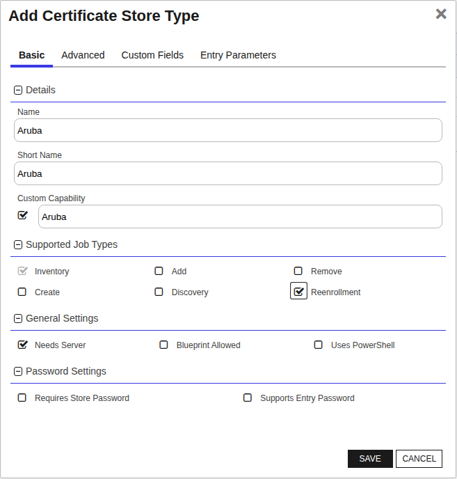
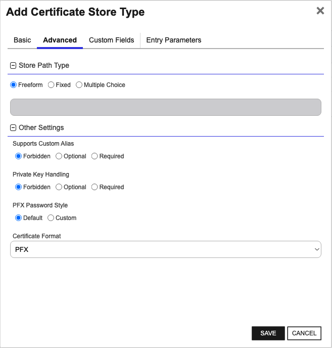
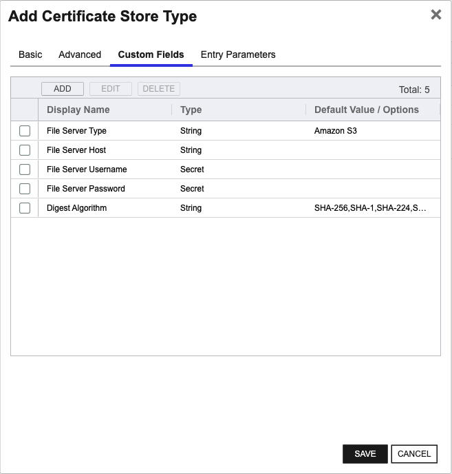
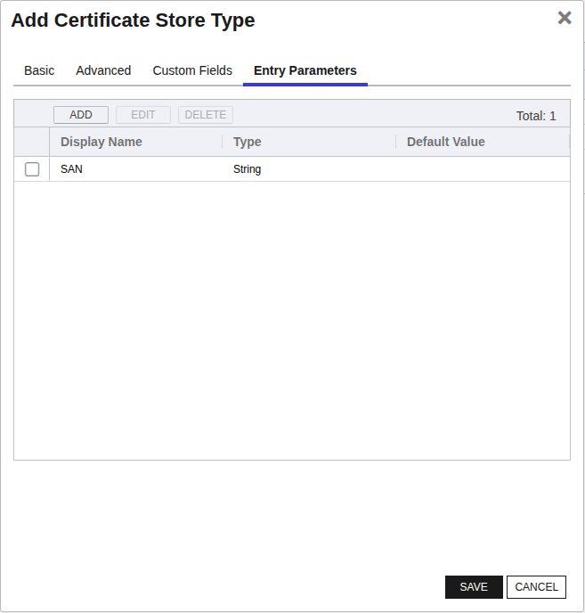
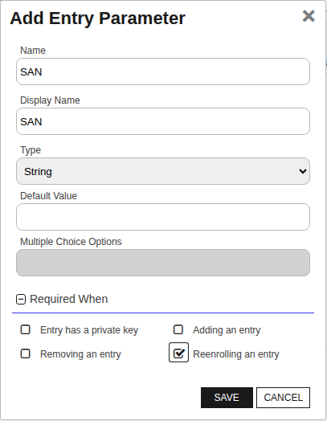

<h1 align="center" style="border-bottom: none">
    Aruba ClearPass Universal Orchestrator Extension
</h1>

<p align="center">
  <!-- Badges -->

<a href="https://github.com/Keyfactor/aruba-clearpass-orchestrator/releases"></a>


</p>

<p align="center">
  <!-- TOC -->
  <a href="#support">
    <b>Support</b>
  </a>
  ·
  <a href="#installation">
    <b>Installation</b>
  </a>
  ·
  <a href="#license">
    <b>License</b>
  </a>
  ·
  <a href="https://github.com/orgs/Keyfactor/repositories?q=orchestrator">
    <b>Related Integrations</b>
  </a>
</p>

## Overview

The Aruba ClearPass Orchestrator Extension is an integration that can inventory and re-enroll certificates on a server in [Aruba ClearPass](https://www.hpe.com/us/en/aruba-clearpass-policy-manager.html).  The certificate store types that can be managed in the current version are:

* Aruba


## Compatibility

This integration is compatible with Keyfactor Universal Orchestrator version 10.1 and later.

## Support
The Aruba ClearPass Universal Orchestrator extension is supported by Keyfactor. If you require support for any issues or have feature request, please open a support ticket by either contacting your Keyfactor representative or via the Keyfactor Support Portal at https://support.keyfactor.com.

> If you want to contribute bug fixes or additional enhancements, use the **[Pull requests](../../pulls)** tab.

## Requirements & Prerequisites

Before installing the Aruba ClearPass Universal Orchestrator extension, we recommend that you install [kfutil](https://github.com/Keyfactor/kfutil). Kfutil is a command-line tool that simplifies the process of creating store types, installing extensions, and instantiating certificate stores in Keyfactor Command.


## Aruba Certificate Store Type

To use the Aruba ClearPass Universal Orchestrator extension, you **must** create the Aruba Certificate Store Type. This only needs to happen _once_ per Keyfactor Command instance.


#### Aruba Requirements


#### Supported Operations

| Operation    | Is Supported                                                                                                           |
|--------------|------------------------------------------------------------------------------------------------------------------------|
| Add          | 🔲 Unchecked        |
| Remove       | 🔲 Unchecked     |
| Discovery    | 🔲 Unchecked  |
| Reenrollment | ✅ Checked |
| Create       | 🔲 Unchecked     |

#### Store Type Creation

##### Using kfutil:
`kfutil` is a custom CLI for the Keyfactor Command API and can be used to create certificate store types.
For more information on [kfutil](https://github.com/Keyfactor/kfutil) check out the [docs](https://github.com/Keyfactor/kfutil?tab=readme-ov-file#quickstart)
   <details><summary>Click to expand Aruba kfutil details</summary>

   ##### Using online definition from GitHub:
   This will reach out to GitHub and pull the latest store-type definition
   ```shell
   # Aruba
   kfutil store-types create Aruba
   ```

   ##### Offline creation using integration-manifest file:
   If required, it is possible to create store types from the [integration-manifest.json](./integration-manifest.json) included in this repo.
   You would first download the [integration-manifest.json](./integration-manifest.json) and then run the following command
   in your offline environment.
   ```shell
   kfutil store-types create --from-file integration-manifest.json
   ```
   </details>


#### Manual Creation
Below are instructions on how to create the Aruba store type manually in
the Keyfactor Command Portal
   <details><summary>Click to expand manual Aruba details</summary>

   Create a store type called `Aruba` with the attributes in the tables below:

   ##### Basic Tab
   | Attribute | Value | Description |
   | --------- | ----- | ----- |
   | Name | Aruba | Display name for the store type (may be customized) |
   | Short Name | Aruba | Short display name for the store type |
   | Capability | Aruba | Store type name orchestrator will register with. Check the box to allow entry of value |
   | Supports Add | 🔲 Unchecked |  Indicates that the Store Type supports Management Add |
   | Supports Remove | 🔲 Unchecked |  Indicates that the Store Type supports Management Remove |
   | Supports Discovery | 🔲 Unchecked |  Indicates that the Store Type supports Discovery |
   | Supports Reenrollment | ✅ Checked |  Indicates that the Store Type supports Reenrollment |
   | Supports Create | 🔲 Unchecked |  Indicates that the Store Type supports store creation |
   | Needs Server | ✅ Checked | Determines if a target server name is required when creating store |
   | Blueprint Allowed | 🔲 Unchecked | Determines if store type may be included in an Orchestrator blueprint |
   | Uses PowerShell | 🔲 Unchecked | Determines if underlying implementation is PowerShell |
   | Requires Store Password | 🔲 Unchecked | Enables users to optionally specify a store password when defining a Certificate Store. |
   | Supports Entry Password | 🔲 Unchecked | Determines if an individual entry within a store can have a password. |

   The Basic tab should look like this:

   

   ##### Advanced Tab
   | Attribute | Value | Description |
   | --------- | ----- | ----- |
   | Supports Custom Alias | Forbidden | Determines if an individual entry within a store can have a custom Alias. |
   | Private Key Handling | Forbidden | This determines if Keyfactor can send the private key associated with a certificate to the store. Required because IIS certificates without private keys would be invalid. |
   | PFX Password Style | Default | 'Default' - PFX password is randomly generated, 'Custom' - PFX password may be specified when the enrollment job is created (Requires the Allow Custom Password application setting to be enabled.) |

   The Advanced tab should look like this:

   

   > For Keyfactor **Command versions 24.4 and later**, a Certificate Format dropdown is available with PFX and PEM options. Ensure that **PFX** is selected, as this determines the format of new and renewed certificates sent to the Orchestrator during a Management job. Currently, all Keyfactor-supported Orchestrator extensions support only PFX.

   ##### Custom Fields Tab
   Custom fields operate at the certificate store level and are used to control how the orchestrator connects to the remote target server containing the certificate store to be managed. The following custom fields should be added to the store type:

   | Name | Display Name | Description | Type | Default Value/Options | Required |
   | ---- | ------------ | ---- | --------------------- | -------- | ----------- |
   | FileServerType | File Server Type | The type of file server that the certificate will be uploaded to. The file server must be able to serve the file via HTTPS. | MultipleChoice | Amazon S3 | ✅ Checked |
   | FileServerHost | File Server Host | Required. The base URL for the file server host without the scheme. (i.e. my-server-name.com if the file server URL is https://my-server-name.com). See File Server Configuration section in the orchestrator documentation for more details. | String |  | ✅ Checked |
   | FileServerUsername | File Server Username | Optional. The username used to access the file server. See File Server Configuration section in the orchestrator documentation for more details. | Secret |  | 🔲 Unchecked |
   | FileServerPassword | File Server Password | Optional. The password used to access the file server. See File Server Configuration section in the orchestrator documentation for more details. | Secret |  | 🔲 Unchecked |
   | DigestAlgorithm | Digest Algorithm | The hash digest algorithm used for the certificate signing request (CSR). | MultipleChoice | SHA-256,SHA-1,SHA-224,SHA-384,SHA-512 | ✅ Checked |

   The Custom Fields tab should look like this:

   

   ##### Entry Parameters Tab

   | Name | Display Name | Description | Type | Default Value | Entry has a private key | Adding an entry | Removing an entry | Reenrolling an entry |
   | ---- | ------------ | ---- | ------------- | ----------------------- | ---------------- | ----------------- | ------------------- | ----------- |
   | SAN | SAN | String value specifying the Subject Alternative Name (SAN) to be used when performing reenrollment jobs. Format as a list of <san_type>:<san_value> entries separated by comma; Example: 'DNS:www.example.com,DNS:www.example2.com' for multiple SANs. Can be made optional if RFC 2818 is disabled on the CA. Allowed SAN types are email, URI, DNS, RID or IP. | String |  | 🔲 Unchecked | 🔲 Unchecked | 🔲 Unchecked | ✅ Checked |

   The Entry Parameters tab should look like this:

   


   ##### SAN

   


   </details>

## Installation

1. **Download the latest Aruba ClearPass Universal Orchestrator extension from GitHub.**

    Navigate to the [Aruba ClearPass Universal Orchestrator extension GitHub version page](https://github.com/Keyfactor/aruba-clearpass-orchestrator/releases/latest). Refer to the compatibility matrix below to determine whether the `net6.0` or `net8.0` asset should be downloaded. Then, click the corresponding asset to download the zip archive.

   | Universal Orchestrator Version | Latest .NET version installed on the Universal Orchestrator server | `rollForward` condition in `Orchestrator.runtimeconfig.json` | `aruba-clearpass-orchestrator` .NET version to download |
   | --------- | ----------- | ----------- | ----------- |
   | Older than `11.0.0` | | | `net6.0` |
   | Between `11.0.0` and `11.5.1` (inclusive) | `net6.0` | | `net6.0` |
   | Between `11.0.0` and `11.5.1` (inclusive) | `net8.0` | `Disable` | `net6.0` |
   | Between `11.0.0` and `11.5.1` (inclusive) | `net8.0` | `LatestMajor` | `net8.0` |
   | `11.6` _and_ newer | `net8.0` | | `net8.0` |

    Unzip the archive containing extension assemblies to a known location.

    > **Note** If you don't see an asset with a corresponding .NET version, you should always assume that it was compiled for `net6.0`.

2. **Locate the Universal Orchestrator extensions directory.**

    * **Default on Windows** - `C:\Program Files\Keyfactor\Keyfactor Orchestrator\extensions`
    * **Default on Linux** - `/opt/keyfactor/orchestrator/extensions`

3. **Create a new directory for the Aruba ClearPass Universal Orchestrator extension inside the extensions directory.**

    Create a new directory called `aruba-clearpass-orchestrator`.
    > The directory name does not need to match any names used elsewhere; it just has to be unique within the extensions directory.

4. **Copy the contents of the downloaded and unzipped assemblies from __step 2__ to the `aruba-clearpass-orchestrator` directory.**

5. **Restart the Universal Orchestrator service.**

    Refer to [Starting/Restarting the Universal Orchestrator service](https://software.keyfactor.com/Core-OnPrem/Current/Content/InstallingAgents/NetCoreOrchestrator/StarttheService.htm).


6. **(optional) PAM Integration**

    The Aruba ClearPass Universal Orchestrator extension is compatible with all supported Keyfactor PAM extensions to resolve PAM-eligible secrets. PAM extensions running on Universal Orchestrators enable secure retrieval of secrets from a connected PAM provider.

    To configure a PAM provider, [reference the Keyfactor Integration Catalog](https://keyfactor.github.io/integrations-catalog/content/pam) to select an extension and follow the associated instructions to install it on the Universal Orchestrator (remote).


> The above installation steps can be supplemented by the [official Command documentation](https://software.keyfactor.com/Core-OnPrem/Current/Content/InstallingAgents/NetCoreOrchestrator/CustomExtensions.htm?Highlight=extensions).


## Defining Certificate Stores


### Store Creation

#### Manually with the Command UI

<details><summary>Click to expand details</summary>

1. **Navigate to the _Certificate Stores_ page in Keyfactor Command.**

    Log into Keyfactor Command, toggle the _Locations_ dropdown, and click _Certificate Stores_.

2. **Add a Certificate Store.**

    Click the Add button to add a new Certificate Store. Use the table below to populate the **Attributes** in the **Add** form.

   | Attribute | Description                                             |
   | --------- |---------------------------------------------------------|
   | Category | Select "Aruba" or the customized certificate store name from the previous step. |
   | Container | Optional container to associate certificate store with. |
   | Client Machine | The base URL / IP address of the Aruba instance without the scheme. (i.e. my-server-name.com if the Aruba URL is https://my-server-name.com) |
   | Store Path | A semicolon-delimited string that in the format `<server-hostname>;<service>` (i.e. clearpass.localhost;HTTP(RSA)). Please see orchestrator documentation for more information. |
   | Orchestrator | Select an approved orchestrator capable of managing `Aruba` certificates. Specifically, one with the `Aruba` capability. |
   | FileServerType | The type of file server that the certificate will be uploaded to. The file server must be able to serve the file via HTTPS. |
   | FileServerHost | Required. The base URL for the file server host without the scheme. (i.e. my-server-name.com if the file server URL is https://my-server-name.com). See File Server Configuration section in the orchestrator documentation for more details. |
   | FileServerUsername | Optional. The username used to access the file server. See File Server Configuration section in the orchestrator documentation for more details. |
   | FileServerPassword | Optional. The password used to access the file server. See File Server Configuration section in the orchestrator documentation for more details. |
   | DigestAlgorithm | The hash digest algorithm used for the certificate signing request (CSR). |

</details>


#### Using kfutil CLI

<details><summary>Click to expand details</summary>

1. **Generate a CSV template for the Aruba certificate store**

    ```shell
    kfutil stores import generate-template --store-type-name Aruba --outpath Aruba.csv
    ```
2. **Populate the generated CSV file**

    Open the CSV file, and reference the table below to populate parameters for each **Attribute**.

   | Attribute | Description |
   | --------- | ----------- |
   | Category | Select "Aruba" or the customized certificate store name from the previous step. |
   | Container | Optional container to associate certificate store with. |
   | Client Machine | The base URL / IP address of the Aruba instance without the scheme. (i.e. my-server-name.com if the Aruba URL is https://my-server-name.com) |
   | Store Path | A semicolon-delimited string that in the format `<server-hostname>;<service>` (i.e. clearpass.localhost;HTTP(RSA)). Please see orchestrator documentation for more information. |
   | Orchestrator | Select an approved orchestrator capable of managing `Aruba` certificates. Specifically, one with the `Aruba` capability. |
   | Properties.FileServerType | The type of file server that the certificate will be uploaded to. The file server must be able to serve the file via HTTPS. |
   | Properties.FileServerHost | Required. The base URL for the file server host without the scheme. (i.e. my-server-name.com if the file server URL is https://my-server-name.com). See File Server Configuration section in the orchestrator documentation for more details. |
   | Properties.FileServerUsername | Optional. The username used to access the file server. See File Server Configuration section in the orchestrator documentation for more details. |
   | Properties.FileServerPassword | Optional. The password used to access the file server. See File Server Configuration section in the orchestrator documentation for more details. |
   | Properties.DigestAlgorithm | The hash digest algorithm used for the certificate signing request (CSR). |

3. **Import the CSV file to create the certificate stores**

    ```shell
    kfutil stores import csv --store-type-name Aruba --file Aruba.csv
    ```

</details>


#### PAM Provider Eligible Fields
<details><summary>Attributes eligible for retrieval by a PAM Provider on the Universal Orchestrator</summary>

If a PAM provider was installed _on the Universal Orchestrator_ in the [Installation](#Installation) section, the following parameters can be configured for retrieval _on the Universal Orchestrator_.

   | Attribute | Description |
   | --------- | ----------- |
   | ServerUsername | Username to use when connecting to server |
   | ServerPassword | Password to use when connecting to server |
   | FileServerUsername | Optional. The username used to access the file server. See File Server Configuration section in the orchestrator documentation for more details. |
   | FileServerPassword | Optional. The password used to access the file server. See File Server Configuration section in the orchestrator documentation for more details. |

Please refer to the **Universal Orchestrator (remote)** usage section ([PAM providers on the Keyfactor Integration Catalog](https://keyfactor.github.io/integrations-catalog/content/pam)) for your selected PAM provider for instructions on how to load attributes orchestrator-side.
> Any secret can be rendered by a PAM provider _installed on the Keyfactor Command server_. The above parameters are specific to attributes that can be fetched by an installed PAM provider running on the Universal Orchestrator server itself.

</details>


> The content in this section can be supplemented by the [official Command documentation](https://software.keyfactor.com/Core-OnPrem/Current/Content/ReferenceGuide/Certificate%20Stores.htm?Highlight=certificate%20store).


## Discovering Certificate Stores with the Discovery Job

### Aruba Discovery Job


## Prerequisites
The following setup is required for this integration:
- An Aruba API client with appropriate operator profile permissions (see [Aruba API Client Setup](#aruba-api-client-setup))
- A file server that can serve uploaded certificates via HTTPS (see [File Server Configuration](#file-server-configuration) for a list of supported file server types)

### Aruba API Client Setup
> Please refer to the [Aruba Networks documentation](https://developer.arubanetworks.com/cppm/docs/api-authorization-oauth2) for the official API client setup guide.

- If you do not already have an API client available, here are the steps to create an API client. Within Aruba ClearPass Guest, go to Administration > API Services > API Clients and select `Create API client`.
- For Operating Mode, choose `ClearPass REST API`
- For Operator Profile, choose the profile you wish to use with the API client. Make sure the Operator Profile meets the [minimum required permissions](#operator-profile-permissions-requirements)
- For the Grant Type, choose `Client credentials`
- Make sure the client is Enabled

Copy the client secret in a secure location. The client ID and client secret will be used in your certificate store configuration.

#### Operator Profile Permissions Requirements

The following permissions are required on your API client's operator profile:
- API Services > Allow API Access > Allow Access
- Platform > Import Configuration > Read Only
- Policy Manager > Certificates > Read, Write

## Store Path Configuration

Aruba manages a single certificate per server + service. Both values are required to update a server certificate. The format of the store path should be `<server-name>;<service-name>`. For example, if you are updating the `clearpass.localhost` server certificate for service `HTTPS (RSA)`, the store path format will be `clearpass.localhost;HTTPS(RSA)`. 

As of writing, acceptable values for `service-name` are as follows:

- RADIUS
- HTTPS(RSA)
- HTTPS(ECC)
- RadSec

To build in flexibility for more Aruba-supported values, the orchestrator **will not perform** validation on the provided `service-name`, but you may run into issues if the service name does not exactly match the values above.

## File Server Configuration

The Aruba ClearPass API requires an HTTP-accessible URL for certificates when performing a re-enrollment. The URL **must** be accessible by the Aruba ClearPass server. Currently, the `FileServerType` types accepted are:

- [Amazon S3](#amazon-s3)

Please see each related section for information on how to configure your certificate store type with the associated file server type.

### Amazon S3

The `Amazon S3` File Server Type supports operations directly to AWS S3 and to S3-compatible services (i.e. Cloudian Hyperstore, MinIO, etc.). If configured to talk to AWS S3 services, we recommend you review the [Amazon S3 Best Practices](https://docs.aws.amazon.com/AmazonS3/latest/userguide/security-best-practices.html) documentation. Otherwise, please consult your AWS-compatible service's documentation for best practices and access policies.

For this file store type, certificate contents will be uploaded to a bucket, and a temporary pre-signed URL will be generated for Aruba ClearPass to access the object via HTTPS.  You will need to configure your provider's security roles that have access to the S3 bucket, can determine the region the S3 bucket is located in, can upload the certificate contents to the bucket, and will need to be able to generate a pre-signed URL for the uploaded certificate file (see [an example IAM policy](#example-aws-iam-policy) if you are targeting AWS).

These are the File Server configurations on the Certificate Store setup:
- File Server Type
    - This value will need to be **Amazon S3**.
- File Server Host
    - If targeting AWS S3, this will be the **S3 bucket name**. S3 bucket names are globally unique identifiers.
    - If targeting an S3-compatible service (i.e. Cloudian Hyperstore, MinIO, etc.), the host will be in the format `<service-url>;<bucket-name>`. For example, `https://s3-us-west1.cloudian.example.com:443;your-bucket-name`.
- File Server Username
    - Optional. If you wish to use IAM user credentials, this will be the **Access Key** for the IAM user credentials.
    - If not provided, the orchestrator can attempt to resolve credentials. See the AWS [Credential and profile resolution](https://docs.aws.amazon.com/sdk-for-net/v3/developer-guide/creds-assign.html) for more information.
- File Server Password
    - Optional. If you wish to use IAM user credentials, this will be the **Secret Access Key** for the IAM user credentials.
    - If not provided, the orchestrator can attempt to resolve credentials. See the AWS [Credential and profile resolution](https://docs.aws.amazon.com/sdk-for-net/v3/developer-guide/creds-assign.html) for more information.


#### Example AWS IAM Policy
Here is an example IAM policy with the minimum permissions necessary:

```json
{
  "Version": "2012-10-17",
  "Statement": [
    {
      "Effect": "Allow",
      "Action": [
        "s3:PutObject",
        "s3:GetObject",
        "s3:GetBucketLocation"
      ],
      "Resource": [
        "arn:aws:s3:::your-bucket-name",
        "arn:aws:s3:::your-bucket-name/*"
      ]
    }
  ]
}
```

## Troubleshooting

### Re-Enrollment / ODKG

#### Command returned a null certificate from the CSR
The error message "Command returned a null certificate from the CSR. Did the subject information included in the CSR match the subject information on the ODKG request" may result if Command rejects the CSR it receives from Aruba.

If this error occurs, check the Command API logs and the Workflow Instance logs for error details.

There are a few reasons for this issue to occur:

##### CSR is Missing Expected Subject
This issue may occur is if the CSR Aruba generates does not contain all the subject information included in the original re-enrollment request. 

As of writing, the Aruba API ***does not*** support email as a subject field for CSR generation. If a re-enrollment request is processed that includes email in the certificate subject, Command may reject the CSR because it does not include email in its subject. To resolve this issue, try excluding the email from the subject (you may include it as a SAN parameter).

##### Missing Required Metadata
This issue may occur if the targeted certificate template does not include the required metadata defined on the certificate template.

For newer versions of Command, required certificate metadata is prompted for when performing a re-enrollment / ODKG. For older versions of Command, the required certificate metadata fields may not be prompted on re-enrollment. As a workaround, if you are running on older versions of Command this issue can be mitigated by updating the metadata as either not required or providing a default value for these fields.

## Contributing

This project welcomes any contributions. Please see the [CONTRIBUTING](./CONTRIBUTING.md) document for a development guide.


## License

Apache License 2.0, see [LICENSE](LICENSE).

## Related Integrations

See all [Keyfactor Universal Orchestrator extensions](https://github.com/orgs/Keyfactor/repositories?q=orchestrator).